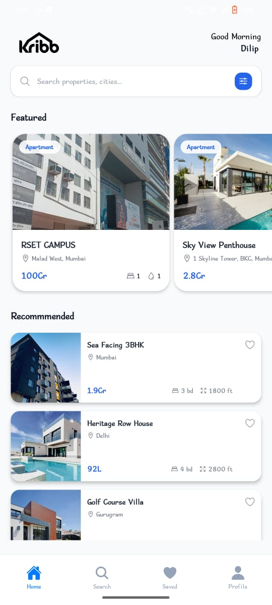
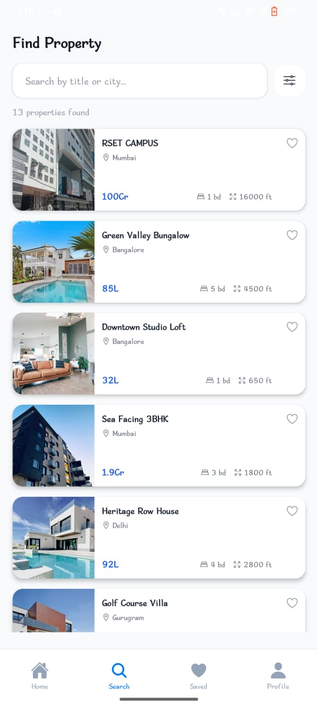
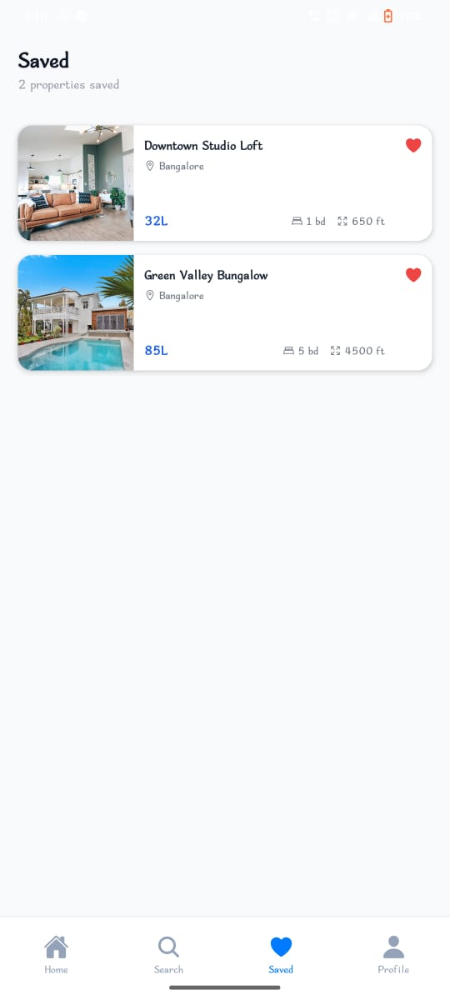
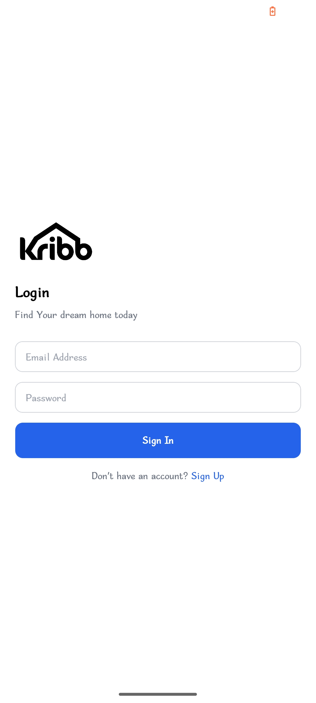
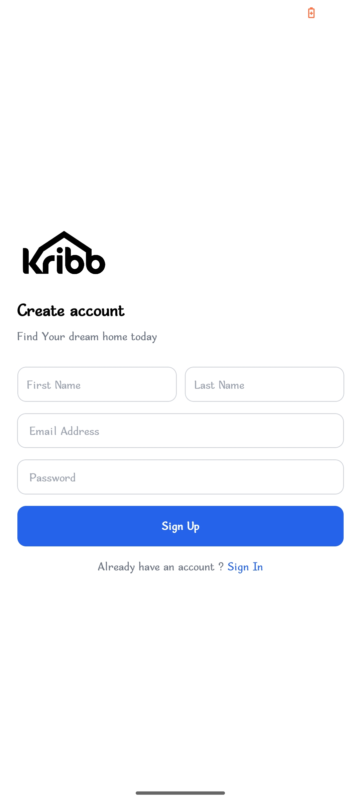
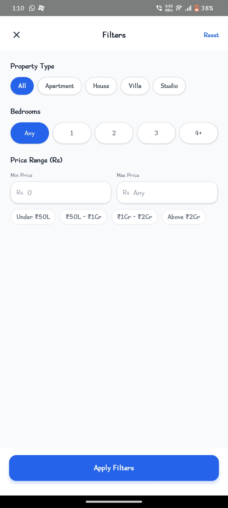
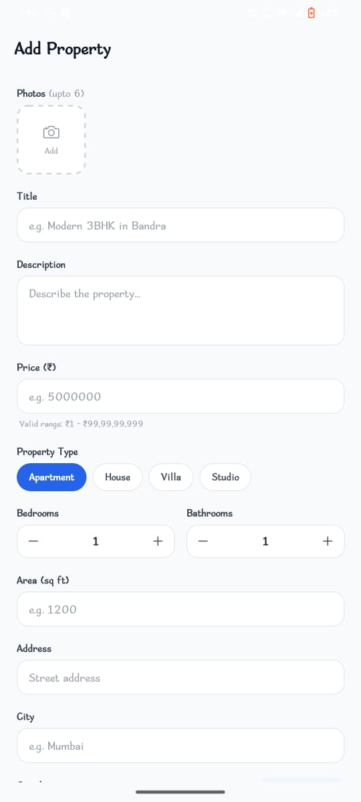

# 🏠 Real Estate Listings App

A modern cross-platform **Real Estate Listings Mobile Application** built using **React Native** and **Expo** for both **iOS** and **Android**.

The app allows users to browse, search, and explore property listings with a clean UI, smooth navigation, and real-time backend integration.

---

# 🚀 Features

- 🔐 User Authentication
- 🏘 Browse Property Listings
- 🔎 Search & Filter Properties
- ❤️ Save Favorite Properties
- 📱 Cross Platform Support (iOS & Android)
- ⚡ Fast & Responsive UI
- ☁️ Supabase Backend Integration
- 🗂 Global State Management with Zustand
- 🎨 Tailwind Styling with NativeWind
- 🧩 Reusable Component Architecture
- 🔄 Real-time Database Support

---

# 🛠 Tech Stack

## Frontend

- React Native
- Expo
- TypeScript
- NativeWind
- Tailwind CSS

## State Management

- Zustand

## Backend & Database

- Supabase
- PostgreSQL

---

# 🧠 State Management

The application uses **Zustand** for lightweight and scalable global state management.

Used for:

- Authentication state
- Saved properties
- Search filters
- App preferences

---

# ☁️ Supabase Integration

Supabase is used for:

- Authentication
- PostgreSQL Database
- Real-time Updates
- Backend APIs
- File Storage

---

# 🎨 Styling

The UI is styled using:

- Tailwind CSS
- NativeWind

Benefits:

- Utility-first styling
- Faster development
- Consistent UI design
- Responsive layouts

---

# 📱 Supported Platforms

- Android
- iOS

---

## App Screenshots

  
  
  
  
  

  
  
  

# 👨‍💻 Author

Developed by Dilip

---
